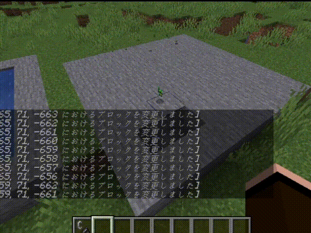

# MCwithCode_Automation
 Minecraft with Code Project による、Minecraft 自動化のサンプルコードを公開しています。自動化は C# 言語を用いて RCON プロトコルを介してコマンドを送信することによって実現できます。使用するには Minecraft のサーバおよび RCON 接続許可が必要です。

https://www.mcwithcode.com/Automation

 </br>

 ## Part 1 -天候と時間の操作-
天候操作コマンドと時間設定コマンドを使用してコマンドの実行方法を学びます。</br>
https://www.mcwithcode.com/Automation/Part1

RCONを使用するにはIPアドレス、ポート番号、パスワードが必要です。

```cs
using CoreRCON;
using System.Net;
//namespace, class
static void main()
{
    IPAddress ipaddress = IPAddress.Parse("127.0.0.1");
    RCON rcon =  new RCON(ipaddress, 25575, "minecraft");
}
```

コマンドを投げるためには async / await を使用します。

```cs
async Task Command()
{
    rcon.ConnectAsync();
    rcon.SendCommandAsync("< Minecraft Command >");
}
```

これらの使い方に慣れて、自動化を進めていきましょう。

</br>

## Part2 -プレイヤー座標の取得-
プレイヤーの相対座標を取得する方法についてです。</br>
https://www.mcwithcode.com/Automation/Part2

```
/data get entity <PlayerName> Pos
```
上記のコマンドを用いると JavaScript オブジェクト形式の文字列として返ってきます。ここから文字列操作をしながら座標を抽出します。

</br>

## Part3 -ブロック配置の基礎-
ブロック配置のコマンドを使用して、任意のブロックを配置します。 </br>
https://www.mcwithcode.com/Automation/Part3

ブロックの配置には相対座標を使用するので、Part2 を活用して実装していきます。

</br>

## Part4 -ブロック配置の応用-
ブロック配置の基礎で学んだ配置方法を応用して、池やネザーゲートなどを作成します。<br>
https://www.mcwithcode.com/Automation/Part4



</br>

## Part5 -鉱石探索の自動化-
足元に眠る鉱石ブロックを探します。</br>
https://www.mcwithcode.com/Automation/Part5

ブロックを判定するコマンドは Minecraft 1.13 にて改訂され、
```
/execute if block <Coordinate> <BlockName>
```
になりました。1.12.2 以前であれば `/testforblock` コマンドが使用できます。

</br>

## Part6 -整地の自動化-
面倒な整地作業（地面を平らにする）をプログラムにやらせます。</br>
https://www.mcwithcode.com/Automation/Part6

条件付きも指定でき、例えば特定のブロックは整地の対象外とすることもできます。

</br>

## Part7 -湧き潰しの自動化-
湧き潰し（光源の設置）を自動で行えるようにします。</br>
https://www.mcwithcode.com/Automation/Part7


水源の上や空気中に松明が配置されないように、少し工夫が必要です。